# 캐릭터 다운로드

https://www.mixamo.com/#/?page=1&type=Character

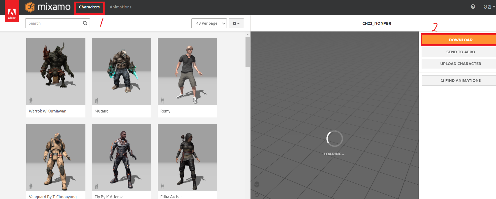

# 블렌더 애니메이션 만들기

1. 캐릭터 가져오기

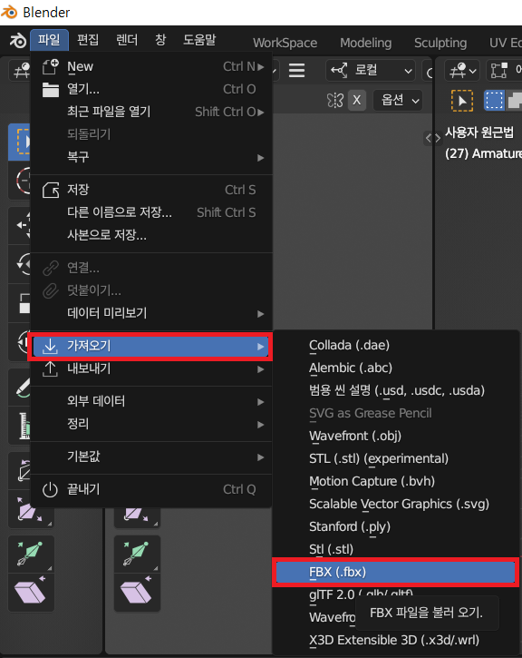

2. 카메라 세팅

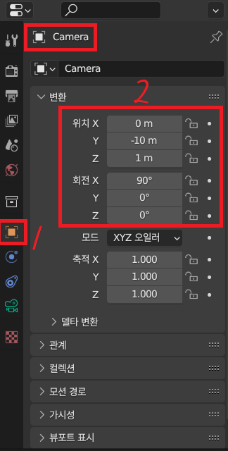

카메라 토글 버튼을 눌렀을 때 아래와 같은 화면이 나오면 됩니다.

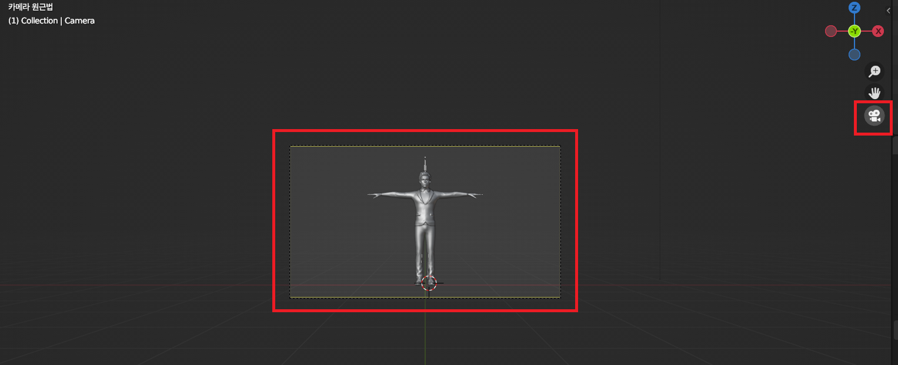

3. 골격 보이기

   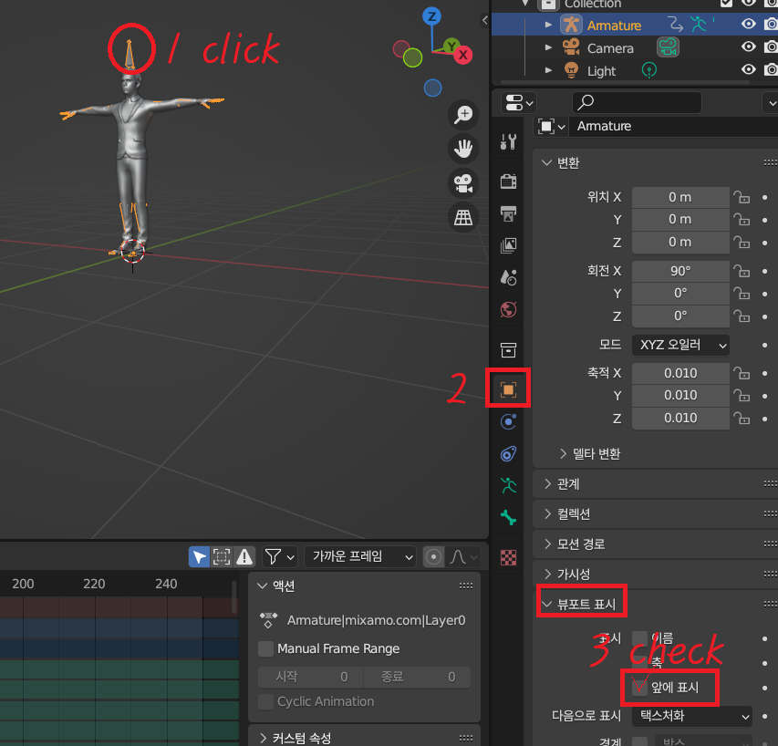

4. 포즈모드로 변경, 뷰포트 셰이딩 변경()

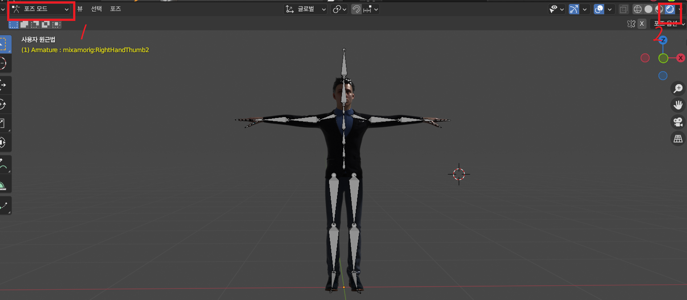

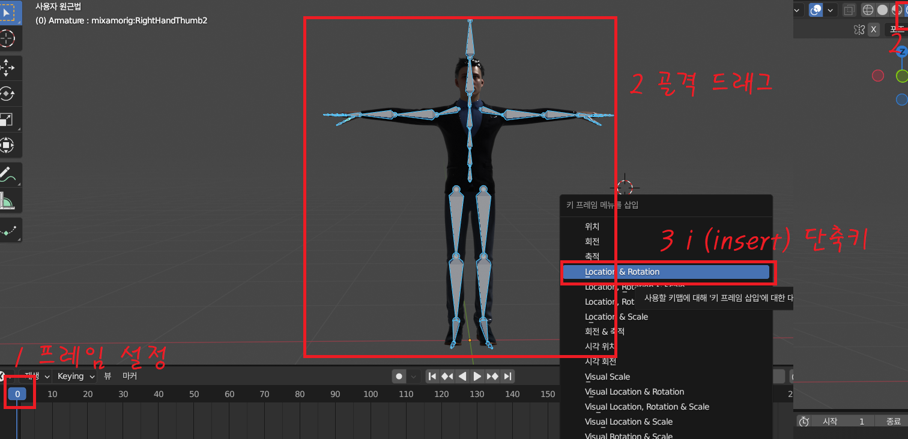

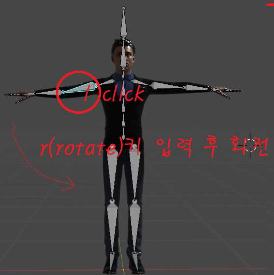

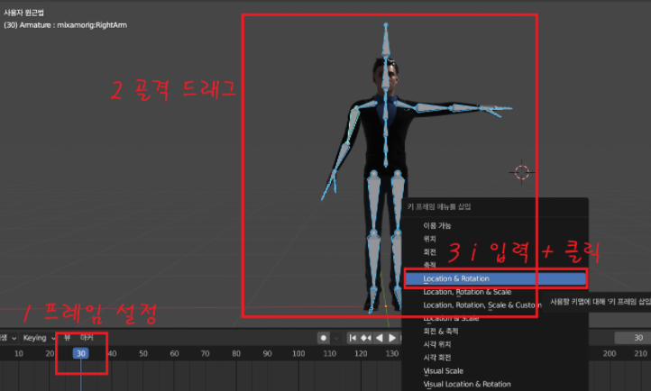

5. 위와 같이 각 프레임별로 동작 설정이 완료되면 저장 설정으로 넘어갑니다.

# 블렌더 애니메이션 렌더링

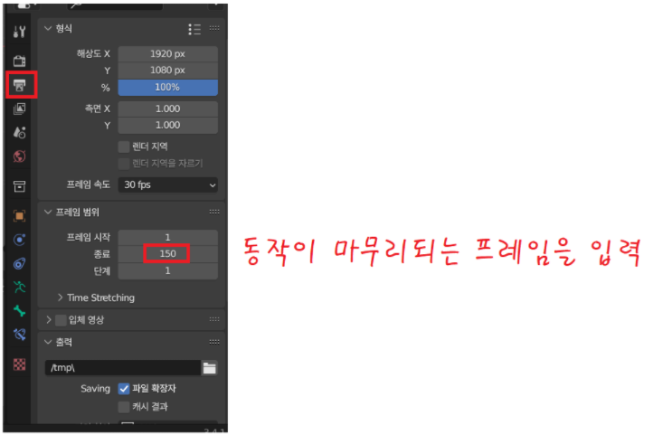

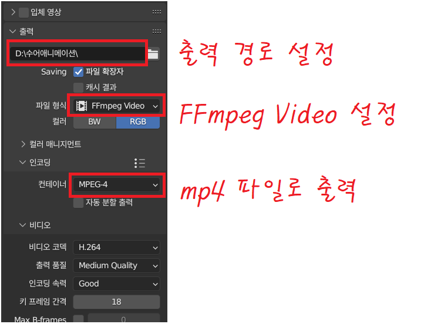

설정이 완료되면 Ctrl + F12 입력하여 애니메이션 렌더링 -> 출력 경로에 영상이 저장됩니다.