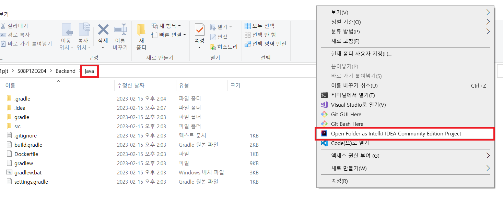
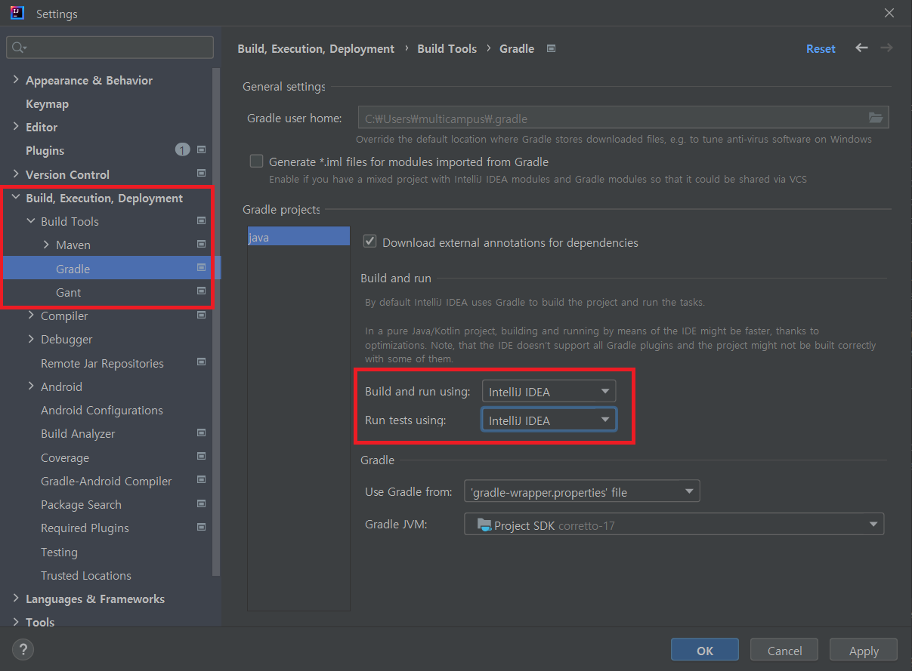
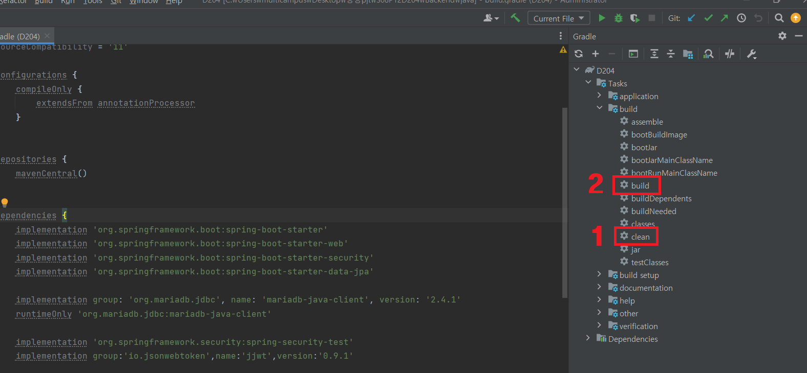
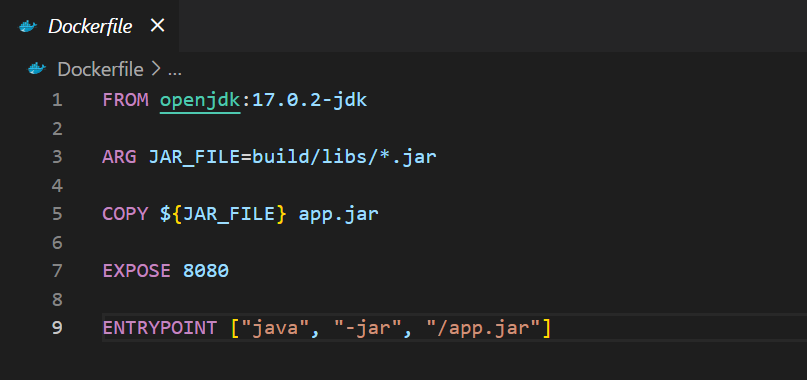
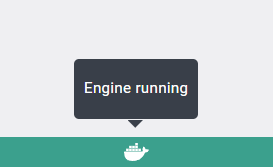

# Backend 실행 방법

```
모든 과정은 intelliJ 기준으로 설명되어있습니다.
```

- 작성자: 홍성민, 이재완


## build 결과물 얻기

backend/java 경로에서`[Open Folder as IntelliJ IDEA Community Edition Project]` 클릭




IntelliJ에서 `[Ctrl + Alt + S]` 단축키 입력 > `Build, Execution, Deployment` > `Build Tools`> `Gradle` > Build and run using, Run tests using 설정을 `IntelliJ IDEA`로 변경




화면 우측 `Gradle` 버튼을 눌러 메뉴바를 펼침 > `clean` 클릭하여 실행 > 클릭하여 `build` 실행 




build/libs 경로에 jar파일이 생성됨

---


## 도커 파일 생성

backend/java 경로에 Dockerfile 파일 생성




## 도커 이미지 생성, 도커 허브에 PUSH

Docker Desktop이 켜져 있는지 확인




backend/java 경로에서 bash 터미널 켜고, 

```
docker login
```

```bash
docker build -t [docker hub 계정명]/[repository명]:[태그명] .
```

ex) docker build -t `songil/backend:v1` .

```
docker push [docker hub 계정명]/[repository명]:[태그명]
```


---

## EC2에 ssh로 접속

```
ssh -i "xxx.pem" ubuntu@xxx
```


## 도커 명령어 입력
도커 허브에 올려져있는 이미지 pull 받기
```
sudo docker pull [docker hub 계정명]/[repository명]:[태그명]
```

도커 이미지 목록 출력
```
sudo docker images
```

컨테이너 생성(--rm: 컨테이너가 중지되면 자동으로 삭제, -d: 백그라운드에서 실행, -p: 포트 설정, --name:컨테이너 이름설정 )
```
sudo docker run --rm -d -p [외부포트]:[내부포트] --name [컨테이너 이름 설정] [image id]
```

도커 컨테이너 목록 출력

```
sudo docker ps		# 실행중인 컨테이너 목록 출력
sudo docker ps -a 	# 중지된 컨테이너도 목록 출력
```

## Nginx 설정
- Openvidu 같은 경우, 카메라를 사용하기 위해서는 반드시 https로 이용해야 하기에 SSL 인증서를 발급받아야 한다. 인증서 발급을 위해서는 도메인이 필요하다.

- 먼저 nginx를 다운 받는다.
```
# 설치
sudo apt-get install nginx

# 설치 확인 및 버전 확인
nginx -v
```
- letsencrypt 설치를 위해 다음과 같은 순서로 명령어를 입력.
```
sudo apt-get install letsencrypt

sudo systemctl stop nginx

sudo letsencrypt certonly --standalone -d www제외한 도메인 이름
```
이렇게 한 후, "Congratulations!"로 시작하는 문구가 보이면, 인증서 발급 완료.

- 인증서 발급 후, /etc/nginx/conf.d/로 이동. 
```
cd /etc/nginx/conf.d
```

- default.conf 파일을 삭제하고 ssafy.conf 파일을 다음과 같이 작성.
```
server {
        proxy_set_header X-Real-IP $remote_addr;
        proxy_set_header X-Forwarded-For $proxy_add_x_forwarded_for;
        proxy_set_header Host $http_host;
        proxy_set_header X-Forwarded-Proto $scheme;

        #Websocket support
        proxy_http_version 1.1;
        proxy_set_header Upgrade $http_upgrade;
        proxy_set_header Connection "upgrade";
        error_page 405 = $uri;

        location /{
                proxy_pass http://localhost:3000;
        }
        location /api/{
                proxy_pass http://localhost:5000;
        }
        location /ai {
                proxy_pass http://localhost:5001;
        }

        location /api/v1/users {
                proxy_pass http://localhost:8080/api/v1/users;
        }
        location /ws{
                proxy_pass http://localhost:8080;
        }
        location /mapping{
                proxy_pass http://localhost:8080;
        }
        location /socket.io{
                proxy_pass http://localhost:5002;
        }

    listen 443 ssl; # managed by Certbot
    server_name i8d204.p.ssafy.io;
    ssl_certificate /etc/letsencrypt/live/i8d204.p.ssafy.io/fullchain.pem; # managed by Certbot
    ssl_certificate_key /etc/letsencrypt/live/i8d204.p.ssafy.io/privkey.pem; # managed by Certbot

    #include /etc/letsencrypt/options-ssl-nginx.conf; # managed by Certbot
    #ssl_dhparam /etc/letsencrypt/ssl-dhparams.pem; # managed by Certbot
}


server {
    if ($host = i8d204.p.ssafy.io) {
        return 301 https://$host$request_uri;
    } # managed by Certbot

        listen 80;
        server_name i8d204.p.ssafy.io;
    return 404; # managed by Certbot
}
```
그 후에 차례로 명령을 실행한다.
```
# 다음 명령어에서 successful이 뜨면 nginx를 실행할 수 있다.
sudo nginx -t

sudo systemctl restart nginx
```

이렇게 실행하면, http로 80포트 접근시, 443 포트(https)로 리다이렉트 된다. 그리고 백엔드 url을 /api/**로 분기처리할 수 있다. https://도메인주소 로 접근하면 배포한 웹 페이지에 접속할 수 있게된다.


## Openvidu 배포
- 반드시 도메인에 대한 letsencrypt 인증서 발급 후, 진행할 것!
- 오픈비두를 배포하기 위한 root 권한을 얻어야 함
```
sudo su
```

- 오픈비두를 설치하기 위해 권장되는 경로인 /opt로 이동
```
cd /opt
```

- 오픈비두 설치 
```
curl https://s3-eu-west-1.amazonaws.com/aws.openvidu.io/install_openvidu_latest.sh | bash
```

- 설치 후 오픈비두가 설치된 경로로 이동
```
cd openvidu
```

- 도메인 또는 퍼블릭 IP와 오픈비두와 통신을 위한 환경설정
```
vim .env

# OpenVidu configuration
# ----------------------
# 도메인 또는 퍼블릭IP 주소
DOMAIN_OR_PUBLIC_IP=i8d204.p.ssafy.io

# 오픈비두 서버와 통신을 위한 시크릿
OPENVIDU_SECRET=MY_SECRET

# Certificate type
CERTIFICATE_TYPE=letsencrypt

# 인증서 타입이 letsencrypt일 경우 이메일 설정
LETSENCRYPT_EMAIL=user@example.com

# HTTP port
HTTP_PORT=80

# HTTPS port(해당 포트를 통해 오픈비두 서버와 연결)
HTTPS_PORT=443
```

- nginx 종료 후 오픈비두 서버 실행 
sudo service nginx stop
./openvidu start

-이후 openvidu 서버 연결 정상적으로 실행되는지 확인
```
netstat -tnl
```
80포트와 443포트가 실행 중이라면 성공 (ssl 인증서 발급을 성공한것)
만일 안 뜬다면, 
```
ufw allow 80;
ufw allow 443;
```
진행 후, `./openvidu restart`, `netstat -tnl`로 계속 443 포트가 실행 중인지 확인
443 포트가 실행이 안 되고 있다면 이후 openvidu 과정 무의미함

-openvidu 서버 포트 변경
```
sudo vim .env
```
```
변경
HTTP_PORT = 8442
HTTPS_PORT = 8443
```

- openvidu 서버 재실행
```
./openvidu restart
```

- 포트 연결 확인
```
netstat -tnl
```
8442와 8443 포트가 실행 중이면 성공

### 복잡한 과정을 거치는 이유!

```
openviduServer가 ssl인증서를 사용할수 있게 하기 위해서 80,443포트에서 자동으로 ssl인증서를 사용할수 있게 하는데 nginx가 켜져 있으면 nginx가 해당 포트를 사용하기 때문에 openvidu서버는 인증서를 사용할 수 없다.
따라서 최초로 한번만 오픈비두 서버가 80,443포트를 사용한다면 openvidu 서버가 ssl인증서를 사용할 수 있기 때문에 이런 복잡한 과정을 거친다.
```
 
- openvidu 서버 통신 확인
``` 
https://도메인:8443/dashboard 에서 통신 확인 가능
사용자 이름: OPENVIDUAPP
비밀번호: MY_SECRET

Insert your secret은 아무거나 입력해도 무관

캠이 실행 중이고, 캠 아래에
Connected to session

Video element created

Camera access allowed

Stream created

Stream playing
라고 출력된다면 오픈비두 과정 성공!
```
(예시 화면)


- 참고: 8443 포트를 통한 통신은 오픈비두 내 nginx에서 알아서 진행하므로, 8443 포트를 위한 추가 nginx를 설정할 필요는 없다.
오픈비두에 대한 더 자세한 설정은 `https://docs.openvidu.io/en/stable/deployment/ce/on-premises/`를 참고할 것.

- 참고: openvidu-tutorials에서 볼 수 있는, 아래와 같은 도커 명령어는 개발용 서버를 위한 것으로, localhost에서만 사용 가능하다. 따라서 배포용으로는 부적합하다.
```
docker run -p 4443:4443 --rm -e OPENVIDU_SECRET=MY_SECRET openvidu/openvidu-dev:2.22.0
```


