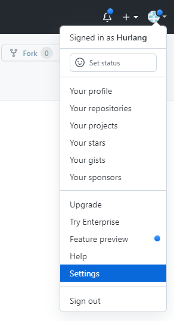
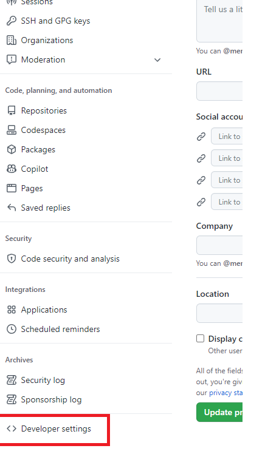
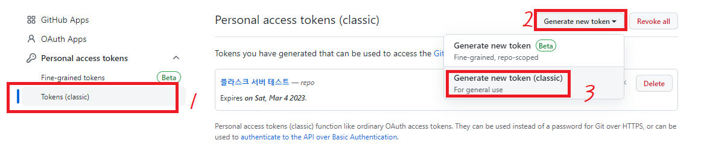

참고: https://wotres.tistory.com/entry/Github-%EC%97%90%EB%9F%AC-%ED%95%B4%EA%B2%B0%EB%B2%95-Authentication-failed-for-use-a-personal-access-token-instead

# git token 발행 방법

1. github에 접속 > `로그인` > `Settings`

2. 좌측 하단 `Developer settings` 클릭

3. `Tokens(classic)` > `Generate new token` > `Generate new token (classic)`

4. `Note` 에 설명 적고 > 쭉 스크롤 내려서 `Generate token` 클릭

5. 터미널에서 `git clone ~~~` > `id`에 `github 이메일` 입력 > `pw`에 `토큰` 입력

