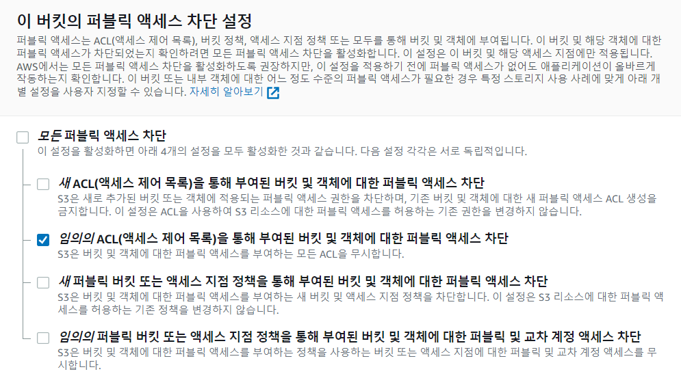

참고: https://velog.io/@jeong-god/Python%EA%B3%BC-AWS-S3%EC%97%B0%EB%8F%99%ED%95%98%EA%B8%B0


# s3 스토리지 생성




# 버킷 정책

1. `버킷` 선택

2. `권한`  >  `버킷 정책` > `편집`

3. `정책 생성기` 클릭

4. ```
   Select Type of Policy = S3 Bucket Policy
   
   ARN = arn:aws:s3:::d204
   Effect = Allow
   Principal = *
   AWS Service = Amazon S3
   Actions = s3:GetObject (이미지를 띄우는 용도로만 사용할 것임)
   Amazon Resource Name(ARN) arn:aws:s3:::d204
   ```

5. `Add Statement` > `Generate Policy` > json 형식 코드 복사

6. 버킷 정책에 붙여넣기 ("Resource": "arn:aws:s3:::d204/*"  <== 경로에 슬래시+애스터리스크 추가해야 오류발생하지않음)

   ```
   {
       "Version": "2012-10-17",
       "Id": "Policy1675319055300",
       "Statement": [
           {
               "Sid": "Stmt1675319051621",
               "Effect": "Allow",
               "Principal": "*",
               "Action": "s3:GetObject",
               "Resource": "arn:aws:s3:::d204/*"
           }
       ]
   }
   ```

   


# IAM 설정

1. AWS에서 IAM 검색 > `사용자` 클릭
2. `사용자 추가` 클릭
3. 사용자 이름 설정한 뒤 `다음`, (엑세스 키는 `프로그래밍 방식 엑세스` 선택)
4. 권한 설정에서 `기존 정책 직접 연결` 선택
5. 정책 필터에 `S3` 검색 `AmazonS3FullAccess` 선택 > `다음`으로
6. 사용자 만들기
7. 액세스 키/ 비밀 액세스 키 csv파일로 저장


# Flask - S3 연동

python에서 s3와 연동하기 위한 라이브러리를 설치합니다.

```
pip3 install boto3
```


Connect 코드

```python
import boto3

def s3_connection():
    try:
        s3 = boto3.client(
            service_name="s3",
            region_name="ap-northeast-2", # 자신이 설정한 bucket region
            aws_access_key_id={엑세스 키 ID},
            aws_secret_access_key={비밀 엑세스 키},
        )
    except Exception as e:
        print(e)
    else:
        print("s3 bucket connected!")
        return s3

s3 = s3_connection()
```


upload 코드

```python
def s3_put_object(s3, bucket, filepath, access_key):
    """
    s3 bucket에 지정 파일 업로드
    :param s3: 연결된 s3 객체(boto3 client)
    :param bucket: 버킷명
    :param filepath: 파일 위치
    :param access_key: 저장 파일명
    :return: 성공 시 True, 실패 시 False 반환
    """
    try:
        s3.upload_file(
            Filename=filepath,
            Bucket=bucket,
            Key=access_key,
            ExtraArgs={"ContentType": "image/jpg", "ACL": "public-read"},
        )
    except Exception as e:
        return False
    return True
```


upload된 이미지 url을 가져오는 코드

```python
def s3_get_image_url(s3, filename):
    """
    s3 : 연결된 s3 객체(boto3 client)
    filename : s3에 저장된 파일 명
    """
    location = s3.get_bucket_location(Bucket={자신이 설정한 버킷 이름})["LocationConstraint"]
    return f"https://{{자신이 설정한 버킷 이름}}.s3.{location}.amazonaws.com/{filename}.jpg"
```


s3에 올린 mp4파일을 브라우저에서 url로 확인할 수 있다.

```
https://d204.s3.ap-northeast-1.amazonaws.com/수어애니메이션/가다.mp4
```


